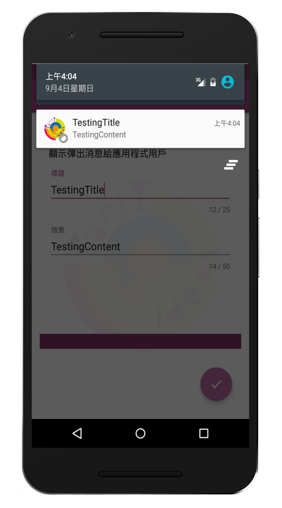
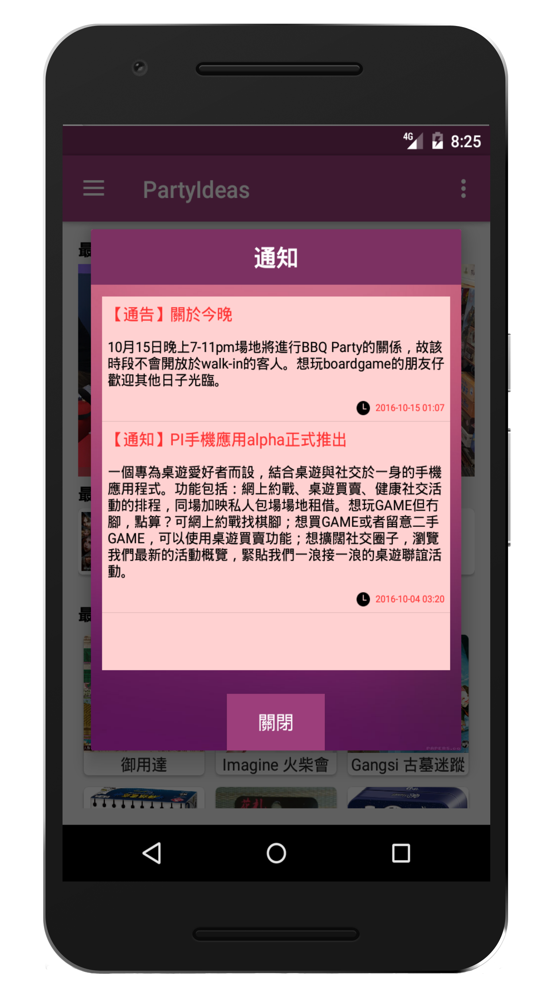

#  PartyIdeas

> IVE 2015/16 Industrial Attachment

[](https://travis-ci.org/alvinau0427/PartyIdeas)
[](LICENSE)

## Getting Started
- The project is an industrial attachment demo which aims for develop a CMS(Content Management System) with the Android application to the startup partroom (Party Ideas HK)

### Features
##### Android Application
- Home Page: List the latest updates or news of all items, so that users can get the most information at first glance, and the inner page shows detailed information.
- Time Schedule: Connect Meetup and Facebook for getting the event calendar and display timetable, the schedule of personal events for online battle is incorporated into the calendar.
- Show Event: Due to the `board games`, `themed parties`, `private venues`, and `art workshops`, the four themes are of the same type. They can be used as the same item and filter different types of items in a filtering way, and the detailed information can be displayed on the same page.
- Purchasing Board Games (Need to log in to Google, Facebook or Meetup account to get the actual function): Display purchasing items, detailed information on the inner page and operation in the shopping basket.
- Board Games Battle (Need to log in to Google, Facebook or Meetup account to get the actual function): Display information about battle rooms (including time, place, people, events) and event participation operations, the inner page shows participants. (i)Opening room setting for the organizer.  (ii) Modify settings midway through the room you have opened.
- Account Connection (Google, Facebook, Meetup): The User name and Email address of the connected account will be displayed in the hidden menu on the left. 
- Push notification (Only set for users with Admin Permission): The latest pop-up message displayed in the database settings, users with Admin Permission can make instant settings in the app.

##### Website
- Database Management: Users with Aamin permission can add any data to the website for management purpose.
- Blacklist: Users can be added to the blacklist for user control of mobile applications
- Approval of event application: As a private charter, the final approval of the online engagement event.
- Handle the purchase of a shopping basket for board games on mobile apps: users with admin permission can check the shopping basket reservation information.

## Screenshots
| Start Page     | Home Page    | Event     |
| :-------------: | :-------------: | :-------------: |
|  |  |  |

| Event Calendar     | Board Game     | Game Details     |
| :-------------: | :-------------: | :-------------: |
|  |  |  |

| Private Booking     | Battle Booking    | Booking Details     |
| :-------------: | :-------------: | :-------------: |
|  |  |  |

| Google Login     | Facebook Login    | Profile     |
| :-------------: | :-------------: | :-------------: |
|  |  |  |

| Navigation Bar     | Setting    | Setting Page     |
| :-------------: | :-------------: | :-------------: |
|  |  |  |

| Multi Language     | Crash Page    | Rate     |
| :-------------: | :-------------: | :-------------: |
|  |  |  |

| Set Notification    | Notification    | Notice     |
| :-------------: | :-------------: | :-------------: |
|  |  |  |

| CMS Website     |
| :-------------: |
|  |

## License
- PartyIdeas is released under the [Apache Version 2.0 License](http://www.apache.org/licenses/LICENSE-2.0.html).
```
Copyright 2016 PartyIdeas & alvinau0427

Licensed under the Apache License, Version 2.0 (the "License");
you may not use this file except in compliance with the License.
You may obtain a copy of the License at

   http://www.apache.org/licenses/LICENSE-2.0

Unless required by applicable law or agreed to in writing, software
distributed under the License is distributed on an "AS IS" BASIS,
WITHOUT WARRANTIES OR CONDITIONS OF ANY KIND, either express or implied.
See the License for the specific language governing permissions and
limitations under the License.
```
